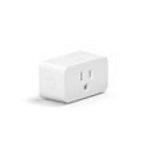

*To contribute to this page, edit the following
[file](https://github.com/Koenkk/zigbee2mqtt.io/blob/master/docs/devices/046677552343.md)*

# Philips 046677552343

| Model | 046677552343  |
| Vendor  | Philips  |
| Description | Hue smart plug bluetooth |
| Exposes | switch (state), linkquality |
| Picture |  |

## Notes


### Power-on behavior
This device allows you to set the power-on behavior. Note that this requires at least November/December '18 firmware update of the device.
Send a MQTT command to [`zigbee2mqtt/FRIENDLY_NAME/set`](https://www.zigbee2mqtt.io/information/mqtt_topics_and_message_structure.html#zigbee2mqttfriendly_nameset) with the following payload.

```js
{
    "hue_power_on_behavior": "on",          // default, on, off, recover
    "hue_power_on_brightness": 125,         // same values as brightness
    "hue_power_on_color_temperature": 280,  // same values as color_temp
    "hue_power_on_color": "#0000FF"         // color in hex notation, e.g. #0000FF = blue
}
```

Attribute Value | Description
----------------|-----------------------------------------------
default         | reset to factory default value
on              | bulb on after power loss with configured brightness, color-temperature and color
off             | bulb off after power loss
recover         | last running state after power loss

Rules:
- `hue_power_on_behavior` value always has to be provided
- `hue_power_on_brightness`, `hue_power_on_color_temperature` and `hue_power_on_color` can only be provided when `hue_power_on_behavior` = `on`
- `hue_power_on_color_temperature` and `hue_power_on_color` cannot be provided together, only one can be set
- When setting `hue_power_on_behavior` = `on`, any not provided values will be reset to their factory defaults

Note: if `hue_power_on_behavior` is set to `off`, then the only way to turn the bulb on will be through a paired smart device (see pairing above). You will NOT be able to turn the bulb on by sequentially switching power on and off.


## OTA updates
This device supports OTA updates, for more information see [OTA updates](../information/ota_updates.md).


## Exposes

### Switch 
The current state of this switch is in the published state under the `state` property (value is `ON` or `OFF`).
To control this switch publish a message to topic `zigbee2mqtt/FRIENDLY_NAME/set` with payload `{"state": "ON"}`, `{"state": "OFF"}` or `{"state": "TOGGLE"}`.
To read the current state of this switch publish a message to topic `zigbee2mqtt/FRIENDLY_NAME/get` with payload `{"state": ""}`.

### Linkquality (numeric)
Link quality (signal strength).
Value can be found in the published state on the `linkquality` property.
It's not possible to read (`/get`) or write (`/set`) this value.
The minimal value is `0` and the maximum value is `255`.
The unit of this value is `lqi`.

## Manual Home Assistant configuration
Although Home Assistant integration through [MQTT discovery](../integration/home_assistant) is preferred,
manual integration is possible with the following configuration:



```yaml
switch:
  - platform: "mqtt"
    state_topic: "zigbee2mqtt/<FRIENDLY_NAME>"
    availability_topic: "zigbee2mqtt/bridge/state"
    payload_off: "OFF"
    payload_on: "ON"
    value_template: "{{ value_json.state }}"
    command_topic: "zigbee2mqtt/<FRIENDLY_NAME>/set"

sensor:
  - platform: "mqtt"
    state_topic: "zigbee2mqtt/<FRIENDLY_NAME>"
    availability_topic: "zigbee2mqtt/bridge/state"
    value_template: "{{ value_json.linkquality }}"
    unit_of_measurement: "lqi"
    enabled_by_default: false
    icon: "mdi:signal"
    state_class: "measurement"

sensor:
  - platform: "mqtt"
    state_topic: "zigbee2mqtt/<FRIENDLY_NAME>"
    availability_topic: "zigbee2mqtt/bridge/state"
    icon: "mdi:update"
    value_template: "{{ value_json['update']['state'] }}"
    enabled_by_default: false

binary_sensor:
  - platform: "mqtt"
    state_topic: "zigbee2mqtt/<FRIENDLY_NAME>"
    availability_topic: "zigbee2mqtt/bridge/state"
    payload_on: true
    payload_off: false
    value_template: "{{ value_json.update_available}}"
    enabled_by_default: false
```



