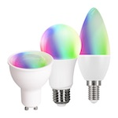

*To contribute to this page, edit the following
[file](https://github.com/Koenkk/zigbee2mqtt.io/blob/master/docs/devices/404000_404005_404012.md)*

# Müller Licht 404000/404005/404012

| Model | 404000/404005/404012  |
| Vendor  | Müller Licht  |
| Description | Tint LED bulb GU10/E14/E27 350/470/806 lumen, dimmable, color, opal white |
| Supports | on/off, brightness, color temperature, color xy |
| Picture |  |

## Notes


### Pairing
Turn the light bulb five times on and off. After turning it on the sixth time,
it will indicate with colors that the bulb is pairing.


### Device type specific configuration
*[How to use device type specific configuration](../information/configuration.md)*


* `transition`: Controls the transition time (in seconds) of on/off, brightness,
color temperature (if applicable) and color (if applicable) changes. Defaults to `0` (no transition).
Note that this value is overridden if a `transition` value is present in the MQTT command payload.


## Manual Home Assistant configuration
Although Home Assistant integration through [MQTT discovery](../integration/home_assistant) is preferred,
manual integration is possible with the following configuration:



```yaml
light:
  - platform: "mqtt"
    state_topic: "zigbee2mqtt/<FRIENDLY_NAME>"
    availability_topic: "zigbee2mqtt/bridge/state"
    brightness: true
    color_temp: true
    xy: true
    schema: "json"
    command_topic: "zigbee2mqtt/<FRIENDLY_NAME>/set"

sensor:
  - platform: "mqtt"
    state_topic: "zigbee2mqtt/<FRIENDLY_NAME>"
    availability_topic: "zigbee2mqtt/bridge/state"
    icon: "mdi:signal"
    unit_of_measurement: "lqi"
    value_template: "{{ value_json.linkquality }}"
```



