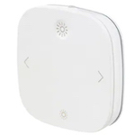

*To contribute to this page, edit the following
[file](https://github.com/Koenkk/zigbee2mqtt.io/blob/master/docs/devices/E2001_E2002.md)*

# IKEA E2001/E2002

| Model | E2001/E2002  |
| Vendor  | IKEA  |
| Description | STYRBAR remote control N2 |
| Exposes | battery, action, linkquality |
| Picture |  |

## Notes

### Device type specific configuration
*[How to use device type specific configuration](../information/configuration.md)*

* `simulated_brightness`: Set to `true` to simulate a `brightness` value (default: `false`).
If this device provides a `brightness_move_up` or `brightness_move_down` action it is possible to specify the update
interval and delta. This can be done by instead of specifying `true`:

```yaml
simulated_brightness:
  delta: 20 # delta per interval, default = 20
  interval: 200 # interval in milliseconds, default = 200
```


## OTA updates
This device supports OTA updates, for more information see [OTA updates](../information/ota_updates.md).


## Exposes

### Battery (numeric)
Remaining battery in %.
Value can be found in the published state on the `battery` property.
It's not possible to read (`/get`) or write (`/set`) this value.
The minimal value is `0` and the maximum value is `100`.
The unit of this value is `%`.

### Action (enum)
Triggered action (e.g. a button click).
Value can be found in the published state on the `action` property.
It's not possible to read (`/get`) or write (`/set`) this value.
The possible values are: `on`, `off`, `brightness_move_up`, `brightness_move_down`, `brightness_stop`, `arrow_left_click`, `arrow_right_click`, `arrow_left_hold`, `arrow_right_hold`, `arrow_left_release`, `arrow_right_release`.

### Linkquality (numeric)
Link quality (signal strength).
Value can be found in the published state on the `linkquality` property.
It's not possible to read (`/get`) or write (`/set`) this value.
The minimal value is `0` and the maximum value is `255`.
The unit of this value is `lqi`.

## Manual Home Assistant configuration
Although Home Assistant integration through [MQTT discovery](../integration/home_assistant) is preferred,
manual integration is possible with the following configuration:



```yaml
sensor:
  - platform: "mqtt"
    state_topic: "zigbee2mqtt/<FRIENDLY_NAME>"
    availability_topic: "zigbee2mqtt/bridge/state"
    value_template: "{{ value_json.battery }}"
    unit_of_measurement: "%"
    device_class: "battery"
    state_class: "measurement"

sensor:
  - platform: "mqtt"
    state_topic: "zigbee2mqtt/<FRIENDLY_NAME>"
    availability_topic: "zigbee2mqtt/bridge/state"
    value_template: "{{ value_json.action }}"
    icon: "mdi:gesture-double-tap"

sensor:
  - platform: "mqtt"
    state_topic: "zigbee2mqtt/<FRIENDLY_NAME>"
    availability_topic: "zigbee2mqtt/bridge/state"
    value_template: "{{ value_json.linkquality }}"
    unit_of_measurement: "lqi"
    enabled_by_default: false
    icon: "mdi:signal"
    state_class: "measurement"

sensor:
  - platform: "mqtt"
    state_topic: "zigbee2mqtt/<FRIENDLY_NAME>"
    availability_topic: "zigbee2mqtt/bridge/state"
    icon: "mdi:update"
    value_template: "{{ value_json['update']['state'] }}"
    enabled_by_default: false

binary_sensor:
  - platform: "mqtt"
    state_topic: "zigbee2mqtt/<FRIENDLY_NAME>"
    availability_topic: "zigbee2mqtt/bridge/state"
    payload_on: true
    payload_off: false
    value_template: "{{ value_json.update_available}}"
    enabled_by_default: false
```



