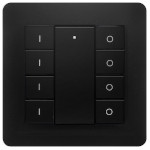

*To contribute to this page, edit the following
[file](https://github.com/Koenkk/zigbee2mqtt.io/blob/master/docs/devices/ED-10015.md)*

# EcoDim ED-10015

| Model | ED-10015  |
| Vendor  | EcoDim  |
| Description | Zigbee 8 button wall switch - black |
| Exposes | battery, action, linkquality |
| Picture |  |

## Notes

### Device type specific configuration
*[How to use device type specific configuration](../information/configuration.md)*

* `simulated_brightness`: Set to `true` to simulate a `brightness` value (default: `false`).
If this device provides a `brightness_move_up` or `brightness_move_down` action it is possible to specify the update
interval and delta. This can be done by instead of specifying `true`:

```yaml
simulated_brightness:
  delta: 20 # delta per interval, default = 20
  interval: 200 # interval in milliseconds, default = 200
```


## Exposes
### Battery (numeric)
Remaining battery in %.
Value can be found in the published state on the `battery` property.
It's not possible to read (`/get`) or write (`/set`) this value.
The minimimal value is `0` and the maximum value is `100`.
The unit of this value is `%`.

### Action (enum)
Triggered action (e.g. a button click).
Value can be found in the published state on the `action` property.
It's not possible to read (`/get`) or write (`/set`) this value.
The possible values are: `on_1`, `off_1`, `brightness_move_up_1`, `brightness_move_down_1`, `brightness_stop_1`, `on_2`, `off_2`, `brightness_move_up_2`, `brightness_move_down_2`, `brightness_stop_2`, `on_3`, `off_3`, `brightness_move_up_3`, `brightness_move_down_3`, `brightness_stop_3`, `on_4`, `off_4`, `brightness_move_up_4`, `brightness_move_down_4`, `brightness_stop_4`.

### Linkquality (numeric)
Link quality (signal strength).
Value can be found in the published state on the `linkquality` property.
It's not possible to read (`/get`) or write (`/set`) this value.
The minimimal value is `0` and the maximum value is `255`.
The unit of this value is `lqi`.

## Manual Home Assistant configuration
Although Home Assistant integration through [MQTT discovery](../integration/home_assistant) is preferred,
manual integration is possible with the following configuration:



```yaml
sensor:
  - platform: "mqtt"
    state_topic: "zigbee2mqtt/<FRIENDLY_NAME>"
    availability_topic: "zigbee2mqtt/bridge/state"
    unit_of_measurement: "%"
    value_template: "{{ value_json.battery }}"
    device_class: "battery"

sensor:
  - platform: "mqtt"
    state_topic: "zigbee2mqtt/<FRIENDLY_NAME>"
    availability_topic: "zigbee2mqtt/bridge/state"
    value_template: "{{ value_json.action }}"
    icon: "mdi:gesture-double-tap"

sensor:
  - platform: "mqtt"
    state_topic: "zigbee2mqtt/<FRIENDLY_NAME>"
    availability_topic: "zigbee2mqtt/bridge/state"
    unit_of_measurement: "lqi"
    value_template: "{{ value_json.linkquality }}"
    icon: "mdi:signal"
```



