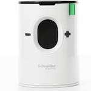

*To contribute to this page, edit the following
[file](https://github.com/Koenkk/zigbee2mqtt.io/blob/master/docs/devices/EER53000.md)*

# Schneider Electric EER53000

| Model | EER53000  |
| Vendor  | Schneider Electric  |
| Description | Wiser radiator thermostat (VACT) |
| Exposes | battery, keypad_lockout, calibrate_valve, valve_calibration_status, zone_mode, climate (occupied_heating_setpoint, local_temperature, local_temperature_calibration, pi_heating_demand), linkquality |
| Picture |  |

## Notes


### Pairing
This device by default only pairs to Wiser Gateways when the set button is pressed, to let it join normal HA gateways (like what Zigbee2MQTT uses) hold the set button down for 5 seconds, and release.


## Exposes

### Battery (numeric)
Remaining battery in %.
Value can be found in the published state on the `battery` property.
It's not possible to read (`/get`) or write (`/set`) this value.
The minimal value is `0` and the maximum value is `100`.
The unit of this value is `%`.

### Keypad_lockout (binary)
Enables/disables physical input on the device.
Value can be found in the published state on the `keypad_lockout` property.
It's not possible to read (`/get`) this value.
To write (`/set`) a value publish a message to topic `zigbee2mqtt/FRIENDLY_NAME/set` with payload `{"keypad_lockout": NEW_VALUE}`.
If value equals `lock1` keypad_lockout is ON, if `unlock` OFF.

### Calibrate_valve (binary)
Calibrates valve on next wakeup.
Value can be found in the published state on the `calibrate_valve` property.
It's not possible to read (`/get`) this value.
To write (`/set`) a value publish a message to topic `zigbee2mqtt/FRIENDLY_NAME/set` with payload `{"calibrate_valve": NEW_VALUE}`.
If value equals `calibrate` calibrate_valve is ON, if `idle` OFF.

### Valve_calibration_status (enum)
Value can be found in the published state on the `valve_calibration_status` property.
It's not possible to read (`/get`) or write (`/set`) this value.
The possible values are: `ongoing`, `successful`, `uncalibrated`, `failed_e1`, `failed_e2`, `failed_e3`.

### Zone_mode (enum)
Icon shown on device displays.
Value can be found in the published state on the `zone_mode` property.
It's not possible to read (`/get`) this value.
To write (`/set`) a value publish a message to topic `zigbee2mqtt/FRIENDLY_NAME/set` with payload `{"zone_mode": NEW_VALUE}`.
The possible values are: `manual`, `schedule`, `energy_saver`, `holiday`.

### Climate 
This climate device supports the following features: `occupied_heating_setpoint`, `local_temperature`, `local_temperature_calibration`, `pi_heating_demand`.
- `occupied_heating_setpoint`: Temperature setpoint. To control publish a message to topic `zigbee2mqtt/FRIENDLY_NAME/set` with payload `{"occupied_heating_setpoint": VALUE}` where `VALUE` is the °C between `7` and `30`. To read send a message to `zigbee2mqtt/FRIENDLY_NAME/get` with payload `{"occupied_heating_setpoint": ""}`.
- `local_temperature`: Current temperature measured on the device (in °C). Reading (`/get`) this attribute is not possible.

### Linkquality (numeric)
Link quality (signal strength).
Value can be found in the published state on the `linkquality` property.
It's not possible to read (`/get`) or write (`/set`) this value.
The minimal value is `0` and the maximum value is `255`.
The unit of this value is `lqi`.

## Manual Home Assistant configuration
Although Home Assistant integration through [MQTT discovery](../integration/home_assistant) is preferred,
manual integration is possible with the following configuration:



```yaml
sensor:
  - platform: "mqtt"
    state_topic: "zigbee2mqtt/<FRIENDLY_NAME>"
    availability_topic: "zigbee2mqtt/bridge/state"
    value_template: "{{ value_json.battery }}"
    unit_of_measurement: "%"
    device_class: "battery"

binary_sensor:
  - platform: "mqtt"
    state_topic: "zigbee2mqtt/<FRIENDLY_NAME>"
    availability_topic: "zigbee2mqtt/bridge/state"
    value_template: "{{ value_json.keypad_lockout }}"
    payload_on: "lock1"
    payload_off: "unlock"

binary_sensor:
  - platform: "mqtt"
    state_topic: "zigbee2mqtt/<FRIENDLY_NAME>"
    availability_topic: "zigbee2mqtt/bridge/state"
    value_template: "{{ value_json.calibrate_valve }}"
    payload_on: "calibrate"
    payload_off: "idle"

sensor:
  - platform: "mqtt"
    state_topic: "zigbee2mqtt/<FRIENDLY_NAME>"
    availability_topic: "zigbee2mqtt/bridge/state"
    value_template: "{{ value_json.valve_calibration_status }}"

sensor:
  - platform: "mqtt"
    state_topic: "zigbee2mqtt/<FRIENDLY_NAME>"
    availability_topic: "zigbee2mqtt/bridge/state"
    value_template: "{{ value_json.zone_mode }}"

climate:
  - platform: "mqtt"
    availability_topic: "zigbee2mqtt/bridge/state"
    temperature_unit: "C"
    temp_step: 0.5
    min_temp: "7"
    max_temp: "30"
    current_temperature_topic: true
    current_temperature_template: "{{ value_json.local_temperature }}"
    temperature_command_topic: "occupied_heating_setpoint"
    temperature_state_template: "{{ value_json.occupied_heating_setpoint }}"
    temperature_state_topic: true

sensor:
  - platform: "mqtt"
    state_topic: "zigbee2mqtt/<FRIENDLY_NAME>"
    availability_topic: "zigbee2mqtt/bridge/state"
    value_template: "{{ value_json.linkquality }}"
    unit_of_measurement: "lqi"
    icon: "mdi:signal"
```



