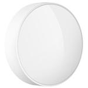

*To contribute to this page, edit the following
[file](https://github.com/Koenkk/zigbee2mqtt.io/blob/master/docs/devices/GZCGQ01LM.md)*

# Xiaomi GZCGQ01LM

| Model | GZCGQ01LM  |
| Vendor  | Xiaomi  |
| Description | MiJia light intensity sensor |
| Supports | illuminance |
| Picture |  |

## Notes

### Device type specific configuration
*[How to use device type specific configuration](../information/configuration.md)*

* `illuminance_lux_calibration`: Allows to manually calibrate illuminance values,
e.g. `95` would take 95% to the illuminance reported by the device; default `100`.


## Exposes
### Battery (numeric)
Remaining battery in %.
Value can be found in the published state on the `battery` property.
It's not possible to read (`/get`) or write (`/set`) this value.
The minimimal value is `0` and the maximum value is `100`.
The unit of this value is `%`.

### Illuminance (numeric)
Raw measured illuminance.
Value can be found in the published state on the `illuminance` property.
It's not possible to read (`/get`) or write (`/set`) this value.

### Illuminance_lux (numeric)
Measured illuminance in lux.
Value can be found in the published state on the `illuminance_lux` property.
It's not possible to read (`/get`) or write (`/set`) this value.
The unit of this value is `lx`.

### Linkquality (numeric)
Link quality (signal strength).
Value can be found in the published state on the `linkquality` property.
It's not possible to read (`/get`) or write (`/set`) this value.
The minimimal value is `0` and the maximum value is `255`.
The unit of this value is `lqi`.

## Manual Home Assistant configuration
Although Home Assistant integration through [MQTT discovery](../integration/home_assistant) is preferred,
manual integration is possible with the following configuration:



```yaml
sensor:
  - platform: "mqtt"
    state_topic: "zigbee2mqtt/<FRIENDLY_NAME>"
    availability_topic: "zigbee2mqtt/bridge/state"
    unit_of_measurement: "%"
    value_template: "{{ value_json.battery }}"
    device_class: "battery"

sensor:
  - platform: "mqtt"
    state_topic: "zigbee2mqtt/<FRIENDLY_NAME>"
    availability_topic: "zigbee2mqtt/bridge/state"
    unit_of_measurement: "-"
    value_template: "{{ value_json.illuminance }}"
    device_class: "illuminance"

sensor:
  - platform: "mqtt"
    state_topic: "zigbee2mqtt/<FRIENDLY_NAME>"
    availability_topic: "zigbee2mqtt/bridge/state"
    unit_of_measurement: "lx"
    value_template: "{{ value_json.illuminance_lux }}"
    device_class: "illuminance"

sensor:
  - platform: "mqtt"
    state_topic: "zigbee2mqtt/<FRIENDLY_NAME>"
    availability_topic: "zigbee2mqtt/bridge/state"
    unit_of_measurement: "lqi"
    value_template: "{{ value_json.linkquality }}"
    icon: "mdi:signal"
```



