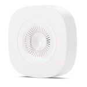

*To contribute to this page, edit the following
[file](https://github.com/Koenkk/zigbee2mqtt.io/blob/master/docs/devices/HMSZB-110.md)*

# Develco HMSZB-110

| Model | HMSZB-110  |
| Vendor  | Develco  |
| Description | Temperature & humidity sensor |
| Supports | temperature, humidity |
| Picture |  |

## Notes

### Device type specific configuration
*[How to use device type specific configuration](../information/configuration.md)*

* `temperature_precision`: Controls the precision of `temperature` values,
e.g. `0`, `1` or `2`; default `2`.
To control the precision based on the temperature value set it to e.g. `{30: 0, 10: 1}`,
when temperature >= 30 precision will be 0, when temperature >= 10 precision will be 1.
* `temperature_calibration`: Allows to manually calibrate temperature values,
e.g. `1` would add 1 degree to the temperature reported by the device; default `0`.


* `humidity_precision`: Controls the precision of `humidity` values, e.g. `0`, `1` or `2`; default `2`.
To control the precision based on the humidity value set it to e.g. `{80: 0, 10: 1}`,
when humidity >= 80 precision will be 0, when humidity >= 10 precision will be 1.


## Exposes
### Battery (numeric)
Remaining battery in %.
Value can be found in the published state on the `battery` property.
It's not possible to read (`/get`) or write (`/set`) this value.
The minimimal value is `0` and the maximum value is `100`.
The unit of this value is `%`.

### Temperature (numeric)
Measured temperature value.
Value can be found in the published state on the `temperature` property.
It's not possible to read (`/get`) or write (`/set`) this value.
The unit of this value is `°C`.

### Humidity (numeric)
Measured relative humidity.
Value can be found in the published state on the `humidity` property.
It's not possible to read (`/get`) or write (`/set`) this value.
The unit of this value is `%`.

### Linkquality (numeric)
Link quality (signal strength).
Value can be found in the published state on the `linkquality` property.
It's not possible to read (`/get`) or write (`/set`) this value.
The minimimal value is `0` and the maximum value is `255`.
The unit of this value is `lqi`.

## Manual Home Assistant configuration
Although Home Assistant integration through [MQTT discovery](../integration/home_assistant) is preferred,
manual integration is possible with the following configuration:



```yaml
sensor:
  - platform: "mqtt"
    state_topic: "zigbee2mqtt/<FRIENDLY_NAME>"
    availability_topic: "zigbee2mqtt/bridge/state"
    unit_of_measurement: "%"
    value_template: "{{ value_json.battery }}"
    device_class: "battery"

sensor:
  - platform: "mqtt"
    state_topic: "zigbee2mqtt/<FRIENDLY_NAME>"
    availability_topic: "zigbee2mqtt/bridge/state"
    unit_of_measurement: "°C"
    value_template: "{{ value_json.temperature }}"
    device_class: "temperature"

sensor:
  - platform: "mqtt"
    state_topic: "zigbee2mqtt/<FRIENDLY_NAME>"
    availability_topic: "zigbee2mqtt/bridge/state"
    unit_of_measurement: "%"
    value_template: "{{ value_json.humidity }}"
    device_class: "humidity"

sensor:
  - platform: "mqtt"
    state_topic: "zigbee2mqtt/<FRIENDLY_NAME>"
    availability_topic: "zigbee2mqtt/bridge/state"
    unit_of_measurement: "lqi"
    value_template: "{{ value_json.linkquality }}"
    icon: "mdi:signal"
```



