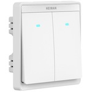

*To contribute to this page, edit the following
[file](https://github.com/Koenkk/zigbee2mqtt.io/blob/master/docs/devices/HS2SW2A_HS2SW2A-N.md)*

# HEIMAN HS2SW2A/HS2SW2A-N

| Model | HS2SW2A/HS2SW2A-N  |
| Vendor  | HEIMAN  |
| Description | Smart switch - 2 gang with neutral wire |
| Exposes | switch (state), device_temperature, linkquality |
| Picture |  |

## Notes

### Device type specific configuration
*[How to use device type specific configuration](../information/configuration.md)*

* `temperature_precision`: Controls the precision of `temperature` values,
e.g. `0`, `1` or `2`; default `2`.
To control the precision based on the temperature value set it to e.g. `{30: 0, 10: 1}`,
when temperature >= 30 precision will be 0, when temperature >= 10 precision will be 1.
* `temperature_calibration`: Allows to manually calibrate temperature values,
e.g. `1` would add 1 degree to the temperature reported by the device; default `0`.


## Exposes
### Switch (left endpoint)
The current state of this switch is in the published state under the `state_left` property (value is `ON` or `OFF`).
To control this switch publish a message to topic `zigbee2mqtt/FRIENDLY_NAME/set` with payload `{"state_left": "ON"}`, `{"state_left": "OFF"}` or `{"state_left": "TOGGLE"}`.
To read the current state of this switch publish a message to topic `zigbee2mqtt/FRIENDLY_NAME/get` with payload `{"state_left": ""}`.

### Switch (right endpoint)
The current state of this switch is in the published state under the `state_right` property (value is `ON` or `OFF`).
To control this switch publish a message to topic `zigbee2mqtt/FRIENDLY_NAME/set` with payload `{"state_right": "ON"}`, `{"state_right": "OFF"}` or `{"state_right": "TOGGLE"}`.
To read the current state of this switch publish a message to topic `zigbee2mqtt/FRIENDLY_NAME/get` with payload `{"state_right": ""}`.

### Device_temperature (numeric)
Temperature of the device.
Value can be found in the published state on the `device_temperature` property.
It's not possible to read (`/get`) or write (`/set`) this value.
The unit of this value is `°C`.

### Linkquality (numeric)
Link quality (signal strength).
Value can be found in the published state on the `linkquality` property.
It's not possible to read (`/get`) or write (`/set`) this value.
The minimimal value is `0` and the maximum value is `255`.
The unit of this value is `lqi`.

## Manual Home Assistant configuration
Although Home Assistant integration through [MQTT discovery](../integration/home_assistant) is preferred,
manual integration is possible with the following configuration:



```yaml
switch:
  - platform: "mqtt"
    state_topic: "zigbee2mqtt/<FRIENDLY_NAME>"
    availability_topic: "zigbee2mqtt/bridge/state"
    payload_off: "OFF"
    payload_on: "ON"
    value_template: "{{ value_json.state_left }}"
    command_topic: "zigbee2mqtt/<FRIENDLY_NAME>/left/set"

switch:
  - platform: "mqtt"
    state_topic: "zigbee2mqtt/<FRIENDLY_NAME>"
    availability_topic: "zigbee2mqtt/bridge/state"
    payload_off: "OFF"
    payload_on: "ON"
    value_template: "{{ value_json.state_right }}"
    command_topic: "zigbee2mqtt/<FRIENDLY_NAME>/right/set"

sensor:
  - platform: "mqtt"
    state_topic: "zigbee2mqtt/<FRIENDLY_NAME>"
    availability_topic: "zigbee2mqtt/bridge/state"
    unit_of_measurement: "°C"
    value_template: "{{ value_json.device_temperature }}"

sensor:
  - platform: "mqtt"
    state_topic: "zigbee2mqtt/<FRIENDLY_NAME>"
    availability_topic: "zigbee2mqtt/bridge/state"
    unit_of_measurement: "lqi"
    value_template: "{{ value_json.linkquality }}"
    icon: "mdi:signal"
```



