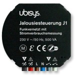

*To contribute to this page, edit the following
[file](https://github.com/Koenkk/zigbee2mqtt.io/blob/master/docs/devices/J1.md)*

# Ubisys J1

| Model | J1  |
| Vendor  | Ubisys  |
| Description | Shutter control J1 |
| Supports | open, close, stop, position, tilt |
| Picture |  |

## Notes


### Configuration of device attributes
By publishing to `zigbee2mqtt/[FRIENDLY_NAME]/set` various device attributes can be configured:
```json
{
    "configure_j1": {
        "windowCoveringType": xxx,
        "configStatus": xxx,
        "installedOpenLimitLiftCm": xxx,
        "installedClosedLimitLiftCm": xxx,
        "installedOpenLimitTiltDdegree": xxx,
        "installedClosedLimitTiltDdegree": xxx,
        "turnaroundGuardTime": xxx,
        "liftToTiltTransitionSteps": xxx,
        "totalSteps": xxx,
        "liftToTiltTransitionSteps2": xxx,
        "totalSteps2": xxx,
        "additionalSteps": xxx,
        "inactivePowerThreshold": xxx,
        "startupSteps": xxx,
        "totalSteps": xxx,
        "totalSteps2": xxx
    }
}
```
For further details on these attributes please take a look at the
[ubisys J1 technical reference manual](https://www.ubisys.de/wp-content/uploads/ubisys-j1-technical-reference.pdf),
chapter "7.2.5. Window Covering Cluster (Server)".

As an alternative to the attributes listed above, the following properties may be used for convenience:
* `open_to_closed_s`: corresponds to `totalSteps`, but takes value in seconds instead of in full AC waves
* `closed_to_open_s`: ditto for `totalSteps2`,
* `lift_to_tilt_transition_ms`: sets both `liftToTiltTransitionSteps` and `liftToTiltTransitionSteps2`
(they shall both be equal according to ubisys manual), but takes value in *milli*seconds instead of in full AC waves
* `steps_per_second`: factor to be used for conversion, defaults to 50 full AC waves per second if not provided

By publishing to `zigbee2mqtt/[FRIENDLY_NAME]/get/configure_j1` the values of the configuration attributes can
also be read back from the device and be printed to the normal zigbee2mqtt log.

### Calibration
By publishing `{"configure_j1": {"calibrate": 1}}` to `zigbee2mqtt/[FRIENDLY_NAME]/set` the device can also be
calibrated after installation to support more advanced positioning features
(i.e. go to lift percentage / go to tilt percentage). This can be combined with setting attributes as shown above,
for example:
```json
{
    "configure_j1": {
        "calibrate" : 1,
        "windowCoveringType": 8,
        "lift_to_tilt_transition_ms": 1600
    }
}
```
The calibration procedure will move the shutter up and down several times and the current stage of the
calibration process will again be logged to the normal zigbee2mqtt log for the user to get some feedback.
For details on the calibration procedure please again take a look at
the [ubisys J1 technical reference manual](https://www.ubisys.de/wp-content/uploads/ubisys-j1-technical-reference.pdf),
chapter "7.2.5.1. Calibration".
Please note that tilt transition steps cannot be determined automatically and must therefore be
configured manually for the device to also support "go to tilt percentage". One possibility to determine the
correct value is to take a video of the blinds moving from 0 to 100 percent tilt and then getting the exact timing
from the video by playing it slow motion.

### Home Assistant cover features when using [MQTT discovery](../integration/home_assistant)
The cover will be offered to Home Assistant as supporting lift and tilt by default, but for covers with reduced
functionality this can be passed along to Home Assistant by disabling some of the topics in `configuration.yaml`,
for example:
```yaml
'0x001fee0000001234':
    friendly_name: cover_not_supporting_tilt'
    homeassistant:
    tilt_command_topic: null
    tilt_status_topic: null
'0x001fee0000001234':
    friendly_name: cover_supporting_neither_lift_nor_tilt'
    homeassistant:
    set_position_topic: null
    position_topic: null
    tilt_command_topic: null
    tilt_status_topic: null
```


## OTA updates
This device supports OTA updates, for more information see [OTA updates](../information/ota_updates.md).

## Manual Home Assistant configuration
Although Home Assistant integration through [MQTT discovery](../integration/home_assistant) is preferred,
manual integration is possible with the following configuration:



```yaml
cover:
  - platform: "mqtt"
    availability_topic: "zigbee2mqtt/bridge/state"
    command_topic: "zigbee2mqtt/<FRIENDLY_NAME>/set"
    set_position_topic: "zigbee2mqtt/<FRIENDLY_NAME>/set"
    set_position_template: "{ \"position\": {{ position }} }"
    tilt_command_topic: true
    position_topic: "zigbee2mqtt/<FRIENDLY_NAME>"
    value_template: "{{ value_json.position }}"
    tilt_status_topic: true
    tilt_status_template: "{{ value_json.tilt }}"

sensor:
  - platform: "mqtt"
    state_topic: "zigbee2mqtt/<FRIENDLY_NAME>"
    availability_topic: "zigbee2mqtt/bridge/state"
    unit_of_measurement: "W"
    icon: "mdi:factory"
    value_template: "{{ value_json.power }}"

sensor:
  - platform: "mqtt"
    state_topic: "zigbee2mqtt/<FRIENDLY_NAME>"
    availability_topic: "zigbee2mqtt/bridge/state"
    icon: "mdi:signal"
    unit_of_measurement: "lqi"
    value_template: "{{ value_json.linkquality }}"
```



