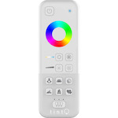

*To contribute to this page, edit the following
[file](https://github.com/Koenkk/zigbee2mqtt.io/blob/master/docs/devices/MLI-404011.md)*

# Müller Licht MLI-404011

| Model | MLI-404011  |
| Vendor  | Müller Licht  |
| Description | Tint remote control |
| Exposes | action, linkquality |
| Picture |  |

## Notes


### Pairing
Remove the battery cover and use the cover to press the button above the batteries.
Press and hold this button for 10-20 seconds and release the button.
After that the remote should show up as a paired device.

### Groups binding
This remote is able to deal with 4 groups:
group0 = All three leds lit
group1 = first led lit
group2 = second led lit
group3 = third let lit

you can direct bind each remote group with a different zigbee group, however there is a caveat: the four zigbee groups have to use consecutive group ids.
The group you will bind (using the frontend or [mqtt command](../information/binding.html)) will be bound to group0 of the remote.
The 3 consecutive groups will be bound to group1 to group3.

This means that you probably should carefully [define your groups id](../information/mqtt_topics_and_message_structure.html#zigbee2mqttbridgeconfigadd_group)  when creating them.

It is possible to bind to a device instead of a group. The device will be bound to group0.
In this case, group0 to group3 will not be usable.

### Device type specific configuration
*[How to use device type specific configuration](../information/configuration.md)*

* `legacy`: Set to `false` to disable the legacy integration (highly recommended!) (default: true)


## Exposes
### Action (enum)
Triggered action (e.g. a button click).
Value can be found in the published state on the `action` property.
It's not possible to read (`/get`) or write (`/set`) this value.
The possible values are: `on`, `off`, `toggle`, `brightness_down_click`, `brightness_up_click`, `color_temp`, `color_wheel`, `brightness_0_release`, `brightness_1_release`, `brightness_0_hold`, `brightness_1_hold`.

### Linkquality (numeric)
Link quality (signal strength).
Value can be found in the published state on the `linkquality` property.
It's not possible to read (`/get`) or write (`/set`) this value.
The minimimal value is `0` and the maximum value is `255`.
The unit of this value is `lqi`.

## Manual Home Assistant configuration
Although Home Assistant integration through [MQTT discovery](../integration/home_assistant) is preferred,
manual integration is possible with the following configuration:



```yaml
sensor:
  - platform: "mqtt"
    state_topic: "zigbee2mqtt/<FRIENDLY_NAME>"
    availability_topic: "zigbee2mqtt/bridge/state"
    value_template: "{{ value_json.action }}"
    icon: "mdi:gesture-double-tap"

sensor:
  - platform: "mqtt"
    state_topic: "zigbee2mqtt/<FRIENDLY_NAME>"
    availability_topic: "zigbee2mqtt/bridge/state"
    unit_of_measurement: "lqi"
    value_template: "{{ value_json.linkquality }}"
    icon: "mdi:signal"
```



