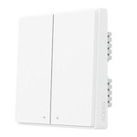

*To contribute to this page, edit the following
[file](https://github.com/Koenkk/zigbee2mqtt.io/blob/master/docs/devices/QBKG24LM.md)*

# Xiaomi QBKG24LM

| Model | QBKG24LM  |
| Vendor  | Xiaomi  |
| Description | Aqara D1 2 gang smart wall switch (with neutral wire) |
| Supports | on/off, power measurement |
| Picture |  |

## Notes


### Pairing
Press and hold the button on the device for +- 10 seconds
(until the blue light starts blinking and stops blinking), release and wait.

You may have to unpair the switch from an existing coordinator before the pairing process will start.


### Decoupled mode
Decoupled mode allows to turn wired switch into wireless button with separately controlled relay.
This might be useful to assign some custom actions to buttons and control relay remotely.
This command also allows to redefine which button controls which relay for the double switch (not supported for QBKG25LM).

Topic `zigbee2mqtt/[FRIENDLY_NAME]/system/set` should be used to modify operation mode.

**NOTE:** For QBKG25LM instead of `system` use `left`, `center` or `right` and leave out the `button` property in the payload.

Payload:
```js
{
  "operation_mode": {
    "button": "single"|"left"|"right", // Always use single for a single switch
    "state": "VALUE"
  }
}
```

Values                | Description
----------------------|---------------------------------------------------------
`control_relay`       | Button directly controls relay (for single switch and QBKG25LM)
`control_left_relay`  | Button directly controls left relay (for double switch, not supported for QBKG25LM)
`control_right_relay` | Button directly controls right relay (for double switch, not supported for QBKG25LM)
`decoupled`           | Button doesn't control any relay

`zigbee2mqtt/[FRIENDLY_NAME]/system/get` to read current mode.

Payload:
```js
{
  "operation_mode": {
    "button": "single"|"left"|"right" // Always use single for a single switch
  }
}
```

Response will be sent to `zigbee2mqtt/[FRIENDLY_NAME]`, example: `{"operation_mode_right":"control_right_relay"}`


## Exposes
### Switch (left endpoint)
The current state of this switch is in the published state under the `state_left` property (value is `ON` or `OFF`).
To control this switch publish a message to topic `zigbee2mqtt/[FRIENDLY_NAME]/set` with payload `{"state_left": "ON"}`, `{"state_left": "OFF"}` or `{"state_left": "TOGGLE"}`.
To read the current state of this switch publish a message to topic `zigbee2mqtt/[FRIENDLY_NAME]/get` with payload `{"state_left": ""}`.

### Switch (right endpoint)
The current state of this switch is in the published state under the `state_right` property (value is `ON` or `OFF`).
To control this switch publish a message to topic `zigbee2mqtt/[FRIENDLY_NAME]/set` with payload `{"state_right": "ON"}`, `{"state_right": "OFF"}` or `{"state_right": "TOGGLE"}`.
To read the current state of this switch publish a message to topic `zigbee2mqtt/[FRIENDLY_NAME]/get` with payload `{"state_right": ""}`.

### Power (numeric)
Instantaneous measured power.
Value can be found in the published state on the `power` property.
To read (`/get`) the value publish a message to topic `zigbee2mqtt/[FRIENDLY_NAME]/get` with payload `{"power": ""}`.
It's not possible to write (`/set`) this value.
The unit of this value is `W`.

### Action (enum)
Triggered action (e.g. a button click).
Value can be found in the published state on the `action` property.
It's not possible to read (`/get`) or write (`/set`) this value.
The possible values are: `hold_left`, `single_left`, `double_left`, `release_left`, `hold_right`, `single_right`, `double_right`, `release_right`, `hold_both`, `single_both`, `double_both`, `release_both`.

### Linkquality (numeric)
Link quality (signal strength).
Value can be found in the published state on the `linkquality` property.
It's not possible to read (`/get`) or write (`/set`) this value.
The minimimal value is `0` and the maximum value is `255`.
The unit of this value is `lqi`.

## Manual Home Assistant configuration
Although Home Assistant integration through [MQTT discovery](../integration/home_assistant) is preferred,
manual integration is possible with the following configuration:



```yaml
switch:
  - platform: "mqtt"
    state_topic: "zigbee2mqtt/<FRIENDLY_NAME>"
    availability_topic: "zigbee2mqtt/bridge/state"
    payload_off: "OFF"
    payload_on: "ON"
    value_template: "{{ value_json.state_left }}"
    command_topic: "zigbee2mqtt/<FRIENDLY_NAME>/left/set"

switch:
  - platform: "mqtt"
    state_topic: "zigbee2mqtt/<FRIENDLY_NAME>"
    availability_topic: "zigbee2mqtt/bridge/state"
    payload_off: "OFF"
    payload_on: "ON"
    value_template: "{{ value_json.state_right }}"
    command_topic: "zigbee2mqtt/<FRIENDLY_NAME>/right/set"

sensor:
  - platform: "mqtt"
    state_topic: "zigbee2mqtt/<FRIENDLY_NAME>"
    availability_topic: "zigbee2mqtt/bridge/state"
    unit_of_measurement: "W"
    value_template: "{{ value_json.power }}"
    icon: "mdi:flash"

sensor:
  - platform: "mqtt"
    state_topic: "zigbee2mqtt/<FRIENDLY_NAME>"
    availability_topic: "zigbee2mqtt/bridge/state"
    value_template: "{{ value_json.action }}"
    icon: "mdi:gesture-double-tap"

sensor:
  - platform: "mqtt"
    state_topic: "zigbee2mqtt/<FRIENDLY_NAME>"
    availability_topic: "zigbee2mqtt/bridge/state"
    unit_of_measurement: "lqi"
    value_template: "{{ value_json.linkquality }}"
    icon: "mdi:signal"
```



