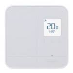

*To contribute to this page, edit the following
[file](https://github.com/Koenkk/zigbee2mqtt.io/blob/master/docs/devices/SMT402AD.md)*

# Stelpro SMT402AD

| Model | SMT402AD  |
| Vendor  | Stelpro  |
| Description | Maestro, line-voltage thermostat |
| Supports | temperature, humidity, outdoor temp display |
| Picture |  |

## Notes

None


## Exposes
### Local_temperature (numeric)
Current temperature measured on the device.
Value can be found in the published state on the `local_temperature` property.
To read (`/get`) the value publish a message to topic `zigbee2mqtt/FRIENDLY_NAME/get` with payload `{"local_temperature": ""}`.
It's not possible to write (`/set`) this value.
The unit of this value is `°C`.

### Lock 
The current state of this lock is in the published state under the `keypad_lockout` property (value is `1` or `0`).
To control this lock publish a message to topic `zigbee2mqtt/FRIENDLY_NAME/set` with payload `{"keypad_lockout": "1"}` or `{"keypad_lockout": "0"}`.
To read the current state of this lock publish a message to topic `zigbee2mqtt/FRIENDLY_NAME/get` with payload `{"keypad_lockout": ""}`.

### Climate 
TODO

### Linkquality (numeric)
Link quality (signal strength).
Value can be found in the published state on the `linkquality` property.
It's not possible to read (`/get`) or write (`/set`) this value.
The minimimal value is `0` and the maximum value is `255`.
The unit of this value is `lqi`.

## Manual Home Assistant configuration
Although Home Assistant integration through [MQTT discovery](../integration/home_assistant) is preferred,
manual integration is possible with the following configuration:



```yaml
sensor:
  - platform: "mqtt"
    state_topic: "zigbee2mqtt/<FRIENDLY_NAME>"
    availability_topic: "zigbee2mqtt/bridge/state"
    unit_of_measurement: "°C"
    value_template: "{{ value_json.local_temperature }}"
    device_class: "temperature"

lock:
  - platform: "mqtt"
    state_topic: true
    availability_topic: "zigbee2mqtt/bridge/state"
    command_topic: "zigbee2mqtt/<FRIENDLY_NAME>/set"
    value_template: "{{ value_json.keypad_lockout }}"
    payload_lock: "1"
    payload_unlock: "0"
    command_topic_postfix: "keypad_lockout"

climate:
  - platform: "mqtt"
    availability_topic: "zigbee2mqtt/bridge/state"
    temperature_unit: "C"
    temp_step: 0.5
    min_temp: "5"
    max_temp: "30"
    current_temperature_topic: true
    current_temperature_template: "{{ value_json.local_temperature }}"
    mode_state_topic: true
    mode_state_template: "{{ value_json.system_mode }}"
    modes: 
      - "off"
      - "auto"
      - "heat"
    mode_command_topic: true
    action_topic: true
    action_template: "{{ values[value_json.running_state] }}"
    temperature_command_topic: "occupied_heating_setpoint"
    temperature_state_template: "{{ value_json.occupied_heating_setpoint }}"
    temperature_state_topic: true

sensor:
  - platform: "mqtt"
    state_topic: "zigbee2mqtt/<FRIENDLY_NAME>"
    availability_topic: "zigbee2mqtt/bridge/state"
    unit_of_measurement: "lqi"
    value_template: "{{ value_json.linkquality }}"
    icon: "mdi:signal"
```



