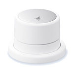

*To contribute to this page, edit the following
[file](https://github.com/Koenkk/zigbee2mqtt.io/blob/master/docs/devices/TERNCY-SD01.md)*

# TERNCY TERNCY-SD01

| Model | TERNCY-SD01  |
| Vendor  | TERNCY  |
| Description | Knob smart dimmer |
| Supports | single, double and triple click, rotate |
| Picture |  |

## Notes


### Deprecated click event
This device exposes a deprecated `click` event. It's recommended to use the `action` event instead.


## Manual Home Assistant configuration
Although Home Assistant integration through [MQTT discovery](../integration/home_assistant) is preferred,
manual integration is possible with the following configuration:



```yaml
sensor:
  - platform: "mqtt"
    state_topic: "zigbee2mqtt/<FRIENDLY_NAME>"
    availability_topic: "zigbee2mqtt/bridge/state"
    icon: "mdi:toggle-switch"
    value_template: "{{ value_json.click }}"

sensor:
  - platform: "mqtt"
    state_topic: "zigbee2mqtt/<FRIENDLY_NAME>"
    availability_topic: "zigbee2mqtt/bridge/state"
    unit_of_measurement: "%"
    device_class: "battery"
    value_template: "{{ value_json.battery }}"

sensor:
  - platform: "mqtt"
    state_topic: "zigbee2mqtt/<FRIENDLY_NAME>"
    availability_topic: "zigbee2mqtt/bridge/state"
    icon: "mdi:signal"
    unit_of_measurement: "lqi"
    value_template: "{{ value_json.linkquality }}"
```



