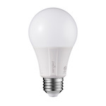

*To contribute to this page, edit the following
[file](https://github.com/Koenkk/zigbee2mqtt.io/blob/master/docs/devices/Z01-A60EAE27.md)*

# Sengled Z01-A60EAE27

| Model | Z01-A60EAE27  |
| Vendor  | Sengled  |
| Description | Element Plus (A60) |
| Exposes | light (state, brightness, color_temp, color_temp_startup), effect, linkquality |
| Picture |  |

## Notes

### Device type specific configuration
*[How to use device type specific configuration](../information/configuration.md)*

* `color_sync`: Synchronizes the color values in the state, e.g. if the state contains `color_temp` and `color.xy` and
the `color_temp` is set, `color.xy` will be updated to match the `color_temp`. (default: `true`)


* `transition`: Controls the transition time (in seconds) of on/off, brightness,
color temperature (if applicable) and color (if applicable) changes. Defaults to `0` (no transition).
Note that this value is overridden if a `transition` value is present in the MQTT command payload.


## OTA updates
This device supports OTA updates, for more information see [OTA updates](../information/ota_updates.md).


## Exposes

### Light 
This light supports the following features: `state`, `brightness`, `color_temp`, `color_temp_startup`.
- `state`: To control the state publish a message to topic `zigbee2mqtt/FRIENDLY_NAME/set` with payload `{"state": "ON"}`, `{"state": "OFF"}` or `{"state": "TOGGLE"}`. To read the state send a message to `zigbee2mqtt/FRIENDLY_NAME/get` with payload `{"state": ""}`.
- `brightness`: To control the brightness publish a message to topic `zigbee2mqtt/FRIENDLY_NAME/set` with payload `{"brightness": VALUE}` where `VALUE` is a number between `0` and `254`. To read the brightness send a message to `zigbee2mqtt/FRIENDLY_NAME/get` with payload `{"brightness": ""}`.
- `color_temp`: To control the color temperature (in reciprocal megakelvin a.k.a. mired scale) publish a message to topic `zigbee2mqtt/FRIENDLY_NAME/set` with payload `{"color_temp": VALUE}` where `VALUE` is a number between `150` and `500`, the higher the warmer the color. To read the color temperature send a message to `zigbee2mqtt/FRIENDLY_NAME/get` with payload `{"color_temp": ""}`. Besides the numeric values the following values are accepected: `coolest`, `cool`, `neutral`, `warm`, `warmest`.
- `color_temp_statup`: To set the startup color temperature (in reciprocal megakelvin a.k.a. mired scale) publish a message to topic `zigbee2mqtt/FRIENDLY_NAME/set` with payload `{"color_temp_startup": VALUE}` where `VALUE` is a number between `150` and `500`, the higher the warmer the color. To read the startup color temperature send a message to `zigbee2mqtt/FRIENDLY_NAME/get` with payload `{"color_temp_startup": ""}`. Besides the numeric values the following values are accepected: `coolest`, `cool`, `neutral`, `warm`, `warmest`, `previous`.

#### Transition
For all of the above mentioned features it is possible to do a transition of the value over time. To do this add an additional property `transition` to the payload which is the transition time in seconds.
Examples: `{"brightness":156,"transition":3}`, `{"color_temp":241,"transition":1}`.

#### Moving/stepping
Instead of setting a value (e.g. brightness) directly it is also possible to:
- move: this will automatically move the value over time, to stop send value `stop` or `0`.
- step: this will increment/decrement the current value by the given one.

The direction of move and step can be either up or down, provide a negative value to move/step down, a positive value to move/step up.
To do this send a payload like below to `zigbee2mqtt/FRIENDLY_NAME/set`

**NOTE**: brightness move/step will stop at the minimum brightness and won't turn on the light when it's off. In this case use `brightness_move_onoff`/`brightness_step_onoff`
````js
{
  "brightness_move": -40, // Starts moving brightness down at 40 units per second
  "brightness_move": 0, // Stop moving brightness
  "brightness_step": 40 // Increases brightness by 40
  "color_temp_move": 60, // Starts moving color temperature up at 60 units per second
  "color_temp_move": "stop", // Stop moving color temperature
  "color_temp_step": 99, // Increase color temperature by 99
}
````

### Effect (enum)
Triggers an effect on the light (e.g. make light blink for a few seconds).
Value will **not** be published in the state.
It's not possible to read (`/get`) this value.
To write (`/set`) a value publish a message to topic `zigbee2mqtt/FRIENDLY_NAME/set` with payload `{"effect": NEW_VALUE}`.
The possible values are: `blink`, `breathe`, `okay`, `channel_change`, `finish_effect`, `stop_effect`.

### Linkquality (numeric)
Link quality (signal strength).
Value can be found in the published state on the `linkquality` property.
It's not possible to read (`/get`) or write (`/set`) this value.
The minimal value is `0` and the maximum value is `255`.
The unit of this value is `lqi`.

## Manual Home Assistant configuration
Although Home Assistant integration through [MQTT discovery](../integration/home_assistant) is preferred,
manual integration is possible with the following configuration:



```yaml
light:
  - platform: "mqtt"
    state_topic: "zigbee2mqtt/<FRIENDLY_NAME>"
    availability_topic: "zigbee2mqtt/bridge/state"
    brightness: true
    schema: "json"
    command_topic: "zigbee2mqtt/<FRIENDLY_NAME>/set"
    brightness_scale: 254
    color_mode: true
    supported_color_modes: 
      - "color_temp"
    max_mireds: 500
    min_mireds: 150
    effect: true
    effect_list: 
      - "blink"
      - "breathe"
      - "okay"
      - "channel_change"
      - "finish_effect"
      - "stop_effect"

sensor:
  - platform: "mqtt"
    state_topic: "zigbee2mqtt/<FRIENDLY_NAME>"
    availability_topic: "zigbee2mqtt/bridge/state"
    value_template: "{{ value_json.linkquality }}"
    unit_of_measurement: "lqi"
    icon: "mdi:signal"

sensor:
  - platform: "mqtt"
    state_topic: "zigbee2mqtt/<FRIENDLY_NAME>"
    availability_topic: "zigbee2mqtt/bridge/state"
    icon: "mdi:update"
    value_template: "{{ value_json['update']['state'] }}"

binary_sensor:
  - platform: "mqtt"
    state_topic: "zigbee2mqtt/<FRIENDLY_NAME>"
    availability_topic: "zigbee2mqtt/bridge/state"
    payload_on: true
    payload_off: false
    value_template: "{{ value_json.update_available}}"
```



