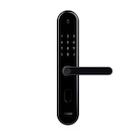

*To contribute to this page, edit the following
[file](https://github.com/Koenkk/zigbee2mqtt.io/blob/master/docs/devices/ZNMS12LM.md)*

# Xiaomi ZNMS12LM

| Model | ZNMS12LM  |
| Vendor  | Xiaomi  |
| Description | Aqara S2 lock |
| Exposes | battery, battery_low, state, reverse, action, linkquality |
| Picture |  |

## Notes

### Device type specific configuration
*[How to use device type specific configuration](../information/configuration.md)*

* `legacy`: Set to `false` to disable the legacy integration (highly recommended!) (default: true)


## Exposes
### Battery (numeric)
Remaining battery in %.
Value can be found in the published state on the `battery` property.
It's not possible to read (`/get`) or write (`/set`) this value.
The minimimal value is `0` and the maximum value is `100`.
The unit of this value is `%`.

### Battery_low (binary)
Indicates if the battery of this device is almost empty.
Value can be found in the published state on the `battery_low` property.
It's not possible to read (`/get`) or write (`/set`) this value.
If value equals `true` battery_low is ON, if `false` OFF.

### State (binary)
Value can be found in the published state on the `state` property.
It's not possible to read (`/get`) or write (`/set`) this value.
If value equals `UNLOCK` state is ON, if `LOCK` OFF.

### Reverse (binary)
Value can be found in the published state on the `reverse` property.
It's not possible to read (`/get`) or write (`/set`) this value.
If value equals `UNLOCK` reverse is ON, if `LOCK` OFF.

### Action (enum)
Value can be found in the published state on the `action` property.
It's not possible to read (`/get`) or write (`/set`) this value.
The possible values are: `finger_not_match`, `password_not_match`, `reverse_lock`, `reverse_lock_cancel`, `locked`, `lock_opened`, `finger_add`, `finger_delete`, `password_add`, `password_delete`, `lock_opened_inside`, `lock_opened_outside`, `ring_bell`, `change_language_to`, `finger_open`, `password_open`, `door_closed`.

### Linkquality (numeric)
Link quality (signal strength).
Value can be found in the published state on the `linkquality` property.
It's not possible to read (`/get`) or write (`/set`) this value.
The minimimal value is `0` and the maximum value is `255`.
The unit of this value is `lqi`.

## Manual Home Assistant configuration
Although Home Assistant integration through [MQTT discovery](../integration/home_assistant) is preferred,
manual integration is possible with the following configuration:



```yaml
sensor:
  - platform: "mqtt"
    state_topic: "zigbee2mqtt/<FRIENDLY_NAME>"
    availability_topic: "zigbee2mqtt/bridge/state"
    unit_of_measurement: "%"
    value_template: "{{ value_json.battery }}"
    device_class: "battery"

binary_sensor:
  - platform: "mqtt"
    state_topic: "zigbee2mqtt/<FRIENDLY_NAME>"
    availability_topic: "zigbee2mqtt/bridge/state"
    value_template: "{{ value_json.battery_low }}"
    payload_on: true
    payload_off: false
    device_class: "battery"

binary_sensor:
  - platform: "mqtt"
    state_topic: "zigbee2mqtt/<FRIENDLY_NAME>"
    availability_topic: "zigbee2mqtt/bridge/state"
    value_template: "{{ value_json.state }}"
    payload_on: "UNLOCK"
    payload_off: "LOCK"

binary_sensor:
  - platform: "mqtt"
    state_topic: "zigbee2mqtt/<FRIENDLY_NAME>"
    availability_topic: "zigbee2mqtt/bridge/state"
    value_template: "{{ value_json.reverse }}"
    payload_on: "UNLOCK"
    payload_off: "LOCK"

sensor:
  - platform: "mqtt"
    state_topic: "zigbee2mqtt/<FRIENDLY_NAME>"
    availability_topic: "zigbee2mqtt/bridge/state"
    value_template: "{{ value_json.action }}"
    icon: "mdi:gesture-double-tap"

sensor:
  - platform: "mqtt"
    state_topic: "zigbee2mqtt/<FRIENDLY_NAME>"
    availability_topic: "zigbee2mqtt/bridge/state"
    unit_of_measurement: "lqi"
    value_template: "{{ value_json.linkquality }}"
    icon: "mdi:signal"
```



