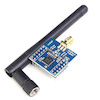
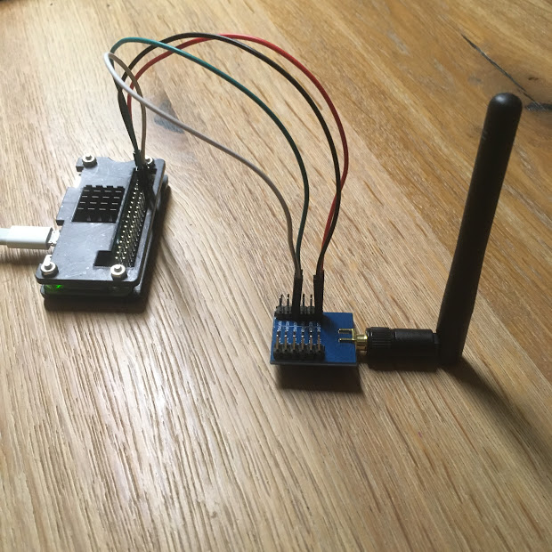

---
---
# Connecting the CC2530

## Using a USB to serial adapter

### Confirmed working
This how-to has been confirmed working with the following CC2530 based devices:

| Device| Image |
| --- | --- |
| **CC2530** |  |

and the following USB to serial adapters:

| Device| Image |
| --- | --- |
| **CP2102** |  |

##### Flashing the firmware
The required coordinator fimrware can be found here: [CC sniffer devices](../information/cc_sniffer_devices.md).

### Connecting
Connect to CC2530 to the USB to serial adapter using the following mapping:

| USB-Serial Adaper  | CC2530  |
| :------------: |:---------------:|
| 3V3 | VCC |
| GND | GND |
| TXD | P02 |
| RXD | P03 |

Now plug in the USB-to-serial adapter in your USB port.

### Configuration
Add the following to your Zigbee2mqtt `configuration.yaml`:

```yaml
advanced:
  rtscts: false
```

and start Zigbee2mqtt, enjoy!

## To a Raspberry Pi (Zero)
CC2530 can be connected to a Raspberry PI (Zero) via GPIO Pins - no USB2FTDI is needed.

The use of UART by the installed Linux has to be disabled: [Detailed explanation here](https://www.raspberrypi.org/documentation/configuration/uart.md)

Enable UART in the Kernel and disable UART use for BlueTooth.

In `/boot/config.txt` add following lines:

```
enable_uart=1
dtoverlay=pi3-disable-bt
```

Disable the modem system service (on the command line):

```
sudo systemctl disable hciuart
```

Remove the console entry by removing any of those entries from `/boot/cmdline.txt` if present:

```
console=serial0,115200 console=ttyAMA0,115200

```

Reboot your Raspberry.

### Wiring CC2530 to the Raspberry

```
CC C2530 -> Raspberry
VCC -> 3,3V (Pin1)
GND -> GND (Pin6)
P02 -> TXD (Pin8 / BCM 14)
P03 -> RXD (Pin10 / BCM 15)
```




### Configuring zigbee2mqtt

Change the Serial Port in your `data/configuration.yaml` file:

```
serial:
  port: /dev/ttyAMA0
advanced:
  baudrate: 115200
  rtscts: false
```

Have fun.

## Via an ESP8266
This setup allows you to connect a CC2530 to an ESP8266 which can be put everywhere in your house. Via a serial socket, Zigbee2mqtt will connect to your CC2530.

### Wiring
Wire the CC2530 to the ESP8266 using the following scheme:

| ESP8266 | CC2530 |
| :------------: |:---------------:|
| 3v3     | VCC |
| GND     | GND |
| TX      | P02 |
| RX      | P03 |
| GND     | P20 |
| GND     | P04 |
| GND     | P05 |

### Flashing the ESP8266
The ESP8266 needs to be flashed with ESPEasy. ESPEasy has suficient documentation on how to get you up and running:
- [How to flash the ESP8266 with ESPEasy](https://www.letscontrolit.com/wiki/index.php?title=Tutorial_ESPEasy_Firmware_Upload)
- ESP8266 firmware: [ESP_Easy_mega-XXXXXXXX_normal_ESP8266_4096.bin](https://github.com/letscontrolit/ESPEasy/releases)
- [More information about ESPEasy](https://www.letscontrolit.com/wiki/index.php/ESPEasy#Introduction)

### Setting up the ESP8266
Open the ESPEasy web interface and complete the setup. Afterwards open the web interface again.

Click on *Devices* Edit of the first task and select *Communication - Serial Server* from the dropdown list.

Fill in the form as following:
```
a.    Name: ZIGBEE2MQTT
b.    Enabled: checked
c.    TCP Port: a number between 1000 and 9999 "1775"
d.    Baud Rate: 115200
e.    Data bits: 8
f.    Parity: No Parity
g.    Stop bits: 1
h.    Reset target after boot: - none –
i.    RX receive timeout: 0
j.    Event processing: Generic
```

Press Submit, the setup is now completed.

### Mounting the serialport
The following instructions need to be executed on the computer that Zigbee2mqtt is running on.

```bash
# Install soccat
sudo apt-get install -y socat

# Create directory for mount point
sudo mkdir /opt/zigbee2mqtt/vusb/

# Give pi user owner rights to /opt/zigbee2mqtt/vusb/
sudo chown -R pi:pi /opt/zigbee2mqtt/vusb/
```

### Comfirm that the connection works
Change the `IP` and `PORT` and execute:

```bash
socat -d -d pty,raw,echo=0,link=/opt/zigbee2mqtt/vusb/zigbee_cc2530 tcp-connect:IP:PORT
```
or

```bash
socat -d -d pty,raw,b115200,echo=0,link=/opt/zigbee2mqtt/vusb/zigbee_cc2530 tcp:127.0.0.1:1775
```

### Mounting the serialport on boot
```bash
sudo nano /etc/systemd/system/socat-vusb.service
```

Add the following to this file (make sure to change the `IP` and `PORT`)

```bash
[Unit]
Description=socat-vusb
After=network-online.target

[Service]
User=pi
ExecStart=/usr/bin/socat -d -d pty,raw,echo=0,link=/opt/zigbee2mqtt/vusb/zigbee_cc2530 tcp:IP:PORT,reuseaddr
Restart=always
RestartSec=10

[Install]
WantedBy=multi-user.target
```
Save the file and exit.

Update systemd:

```bash
sudo systemctl --system daemon-reload
```

Verify that the configuration works:
```bash
sudo systemctl start socat-vusb.service
 ```

Show status
```bash
systemctl status socat-vusb.service
```

In case you run Zigbee2mqtt as daemon, replace the contents of `sudo nano /etc/systemd/system/zigbee2mqtt.service` with below:

```
[Unit]
Description=zigbee2mqtt
Wants=socat-vusb.service
After=network.target socat-vusb.service

[Service]
ExecStart=/usr/bin/npm start
WorkingDirectory=/opt/zigbee2mqtt
StandardOutput=inherit
StandardError=inherit
Restart=always
User=pi

[Install]
WantedBy=multi-user.target
```

### Restart and check Log
```bash
sudo systemctl restart socat-vusb.service && sudo journalctl -f -u socat-vusb.service
```

Now that everything works, we want systemctl to start socat-vusb automatically on boot, this can be done by executing:

```bash
sudo systemctl enable socat-vusb.service
```

### Some tips that can be handy later:
Stopping socat-vusb
```bash
sudo systemctl stop socat-vusb
```

Starting socat-vusb
```bash
sudo systemctl start socat-vusb
```

### View the log of socat-vusb
```bash
sudo journalctl -u socat-vusb.service -f

Output should look like:
```bash
pi@hassbian:~ $ systemctl status socat-vusb.service
● socat-vusb.service - socat-vusb
   Loaded: loaded (/etc/systemd/system/socat-vusb.service; enabled; vendor preset: enabled)
   Active: active (running) since Fri 2019-02-01 15:35:24 UTC; 4min 11s ago
 Main PID: 1406 (socat)
   CGroup: /system.slice/socat-vusb.service
           └─1406 /usr/bin/socat -d -d pty,raw,b115200,echo=0,link=/opt/zigbee2mqtt/vusb/zigbee_cc2530 tcp:127.0.0.1:1775,reuseaddr

Feb 01 15:35:24 hassbian systemd[1]: Started socat-vusb.
Feb 01 15:35:24 hassbian socat[1406]: 2019/02/01 15:35:24 socat[1406] N PTY is /dev/pts/3
Feb 01 15:35:24 hassbian socat[1406]: 2019/02/01 15:35:24 socat[1406] N opening connection to AF=2 127.0.0.1:1775
Feb 01 15:35:24 hassbian socat[1406]: 2019/02/01 15:35:24 socat[1406] N successfully connected from local address AF=2 127.0.0.1:47512
Feb 01 15:35:24 hassbian socat[1406]: 2019/02/01 15:35:24 socat[1406] N starting data transfer loop with FDs [5,5] and [7,7]
```

### Adding virtual device to zigbee2mqtt config
```bash
sudo nano  /opt/zigbee2mqtt/data/configuration.yaml
```

```yaml
serial:
  port: /opt/zigbee2mqtt/vusb/zigbee_cc2530

advanced:
  rtscts: false
```

### Restart zigbee2mqtt and confirm it works.
```bash
sudo systemctl restart zigbee2mqtt.service && sudo journalctl -f -u zigbee2mqtt.service
```
