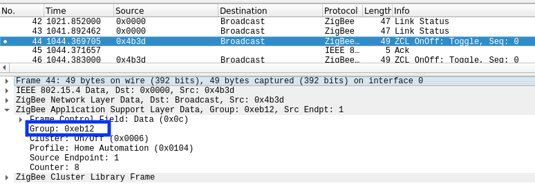

# Coordinator group

Some devices require extra setup as they are only meant to control groups. Therefore they do not send any information directly to the coordinator. As the group ID is randomized upon factory reset we need to find out the group ID where the device sends its commands to. This can be done by using Zigbee sniffing.

## Which devices require this?
- IKEA TRADFRI remote control (E1524)
- Müller Licht Tint remote control (MLI-404011)

## How to retrieve the group ID
1. Pair the device to Zigbee2mqtt.
2. Setup your Zigbee traffic sniffer by following [How to sniff Zigbee traffic](../how_tos/how_to_sniff_zigbee_traffic.md).
3. Press a button on the device, this will produce the following message in Wireshark:

4. Retrieve the group from the message, which is `0xeb12` in the above example.
5. Add the group to the device in `configuration.yaml`, example:
```yaml
devices:
  '0x000b57fffecb472d':
    friendly_name: '0x000b57fffecb472d'
    retain: false
    coordinator_group: 0xeb12
```
6. Restart Zigbee2mqtt, when everything went OK you will see:
```
zigbee2mqtt:info 1/8/2019, 8:42:40 PM Sucesfully applied coordinator group for IKEA TRADFRI remote control (0x000b57fffecb472d)
```
## Why is this needed?
The devices send the group ID using touchlink commissioning (while holding the reset button close to a bulb). This is currently not supported by the firmware (Z-Stack 1.2 HA). Perhaps it will work in Z-Stack 3.0.